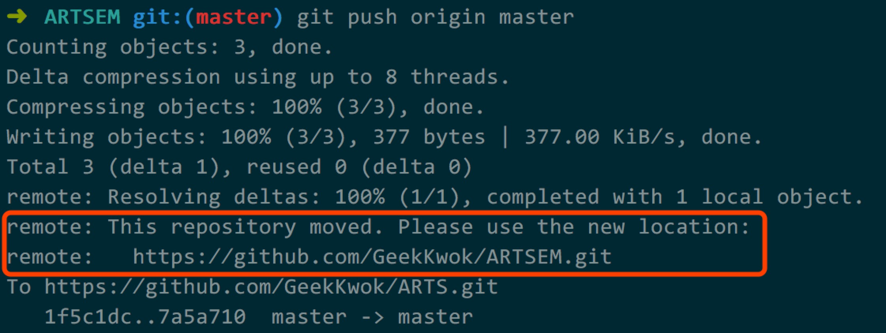

## **git之set-url命令**
git远端仓库与本地仓库做了关联后, 若修改了远端仓库的名称, 则将更新从本地仓库推送到远端仓库时, 会出现如下的提示信息:

即提示你远端仓库已经移动了, 请使用新位置, 并给出新位置的地址.

我们平时推送远端仓库的git命令:
> git push origin master

从上述命令知道`origin`就是我们指的远端仓库, 那么我们要通过如下命令来修改这个地址:
> #显示当前的远端仓库地址 
> git remote -v 
> #修改远端仓库地址 
> git remote set-url origin https://github.com/GeekKwok/ARTSEM.git

通过上述命令即可修改远端仓库地址.
